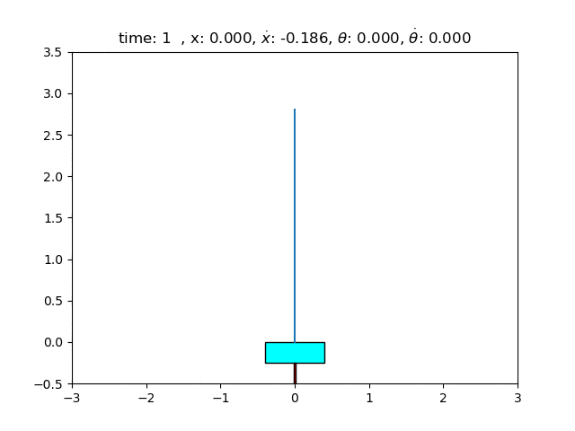

# Stanford's CS229 Problem Solutions (Summer 2019, 2020)

  

This is my own solution for Stanford's CS229 problem sets. These problem sets are designed for the summer edition (2019, 2020) of the course. My solutions can be found in the `psets` folder (both source code for coding questions and pdf's for writing questions). You can find materials of this course (lecture notes, raw unsolved psets) in the `archive` folder. Lecture videos are available on [YouTube](https://www.youtube.com/playlist?list=PLoROMvodv4rNH7qL6-efu_q2_bPuy0adh).

Introduction from CS229's webpage:

*"This is the summer edition of CS229 Machine Learning that was offered over 2019 and 2020. CS229 provides a broad introduction to statistical machine learning (at an intermediate / advanced level) and covers supervised learning (generative/discriminative learning, parametric/non-parametric learning, neural networks, support vector machines); unsupervised learning (clustering, dimensionality reduction, kernel methods); learning theory (bias/variance tradeoffs, practical ); and reinforcement learning among other topics. The structure of the summer offering enables coverage of additional topics, places stronger emphasis on the mathematical and visual intuitions, and goes deeper into the details of various topics."* 

Tl;dr: This is an enhancement of the original favorite CS229 course. I do not own anything. For more information, please visit [the course's webpage](http://cs229.stanford.edu/syllabus-summer2019.html). Please open a new issue if you spot any error. 

Happy learning, peace.

## Contribution
The list of contributors who pointed out errors and suggested solutions:
- Nguyễn Thành Đô: fixed problem 4c.
